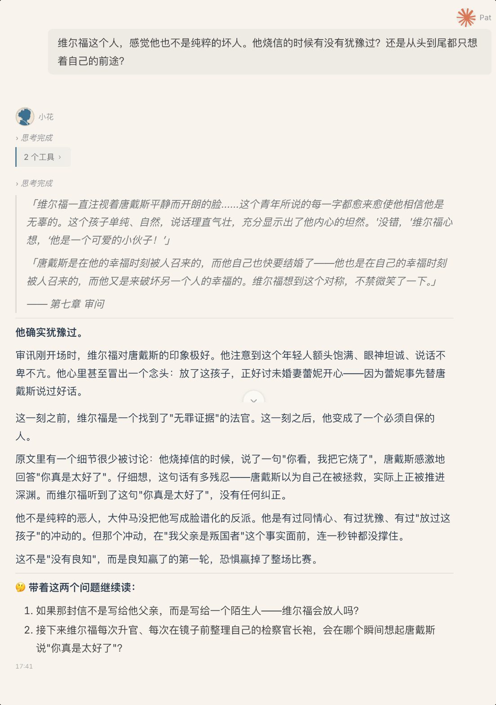

# Reading Note — 深度读书笔记助手

> 融合**费曼学习法** + **苏格拉底学习法**的 AI 读书笔记 skill。
> 你用自己的话说感受，AI 帮你找原文、建角色卡、维护人物关系图。



## 安装

**方式一：一句话安装（推荐）**

复制下面这句话发给你的 Agent：

```
帮我安装 reading-note skill，GitHub 地址：https://github.com/perinchiang/reading-note
```

**方式二：手动下载**

1. 下载本仓库所有文件
2. 放入你的 Agent skill 目录
3. 重启或重载 Agent

## 快速开始

安装后，把下面任意一句发给你的 Agent 即可：

```
我在看《XXX》
```

```
这一章读下来，我觉得主角做了一个很蠢的决定……
```

```
上次看到哪了
```

```
为什么作者要在这里安排这个角色出场？
```

## 核心理念

- **费曼原则** — 用户用自己的话说感受和评价，AI 去搜原文做 blockquote 对照。理解优先于摘抄。
- **苏格拉底原则** — AI 每次回答疑问后，留 1~2 个开放性问题，让用户带着问题继续阅读。

## 做什么

| 功能 | 说明 |
|---|---|
| 📖 初始化新书 | 搜书信息、封面、章节目录 → 一键建笔记 |
| 💬 追加想法 | 用户的感受、人物评价、剧情理解 → AI 补原文 + 整理 |
| ❓ 问答记录 | 提问 → AI 解答 → 留苏式思考题 → 全记入笔记 |
| 🧑‍🤝‍🧑 自动实体发现 | 新人物/新地点 → 自动创建角色卡片 |
| 🔗 人物关系图 | mermaid 图持续更新，可视全家谱 |

## 依赖

- web_search（搜书信息、原文引用）
- curl（下载封面）
- Obsidian vault（推荐，路径灵活）

## License

MIT
